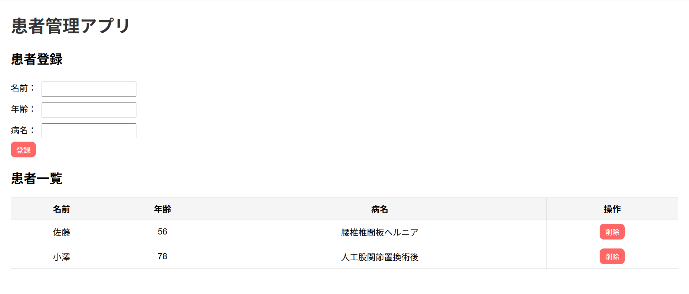

# 患者管理アプリ（Patient Management App）

## ■ 概要
患者情報（名前・年齢・病名）を登録・一覧表示・削除できるWebアプリです。

## ■ 画面イメージ
### 患者一覧画面・登録フォーム

## ■ 使用技術
- Java（Spring Boot）
- HTML / CSS / JavaScript
- H2 Database
- REST API

## ■ 機能
- 患者登録（POST）
- 患者一覧表示（GET）
- 患者削除（DELETE）

## ■ 工夫した点
- JavaScriptのfetchを使った非同期通信で画面更新
- テーブル形式で見やすいUIに調整
- 削除確認ダイアログを実装

## ■ 今後の改善
- 更新機能（PUT）の追加
- バリデーション追加
- MySQLへのDB変更
- UIデザインの改善
